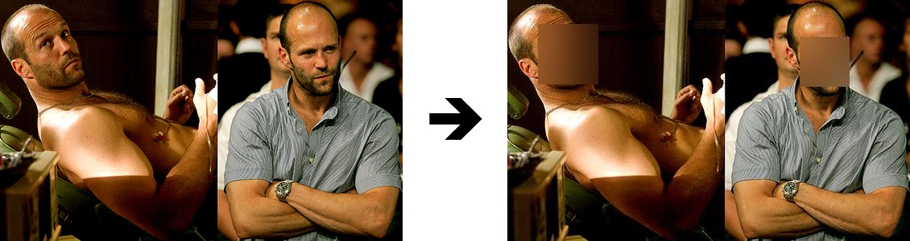
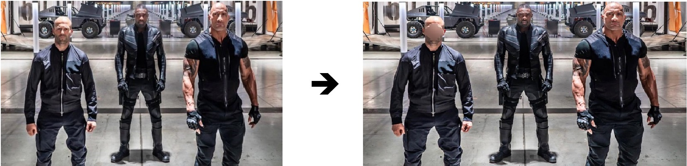

# Blur faces using facial recognition

This project makes it possible to blur the faces of people present in a list of predefined images.  

## Fork [ageitgey](https://github.com/ageitgey/face_recognition)

## Requirements 
- Python 3 
- face_recognition
- Pillow
- scikit_learn

## Installation
*It was coded on Linux but can run on Windows.*
### Installating on Linux
```bash
sudo apt-get install python3 git
sudo apt-get install python3-pip
pip3 install face_recognition Pillow scikit_learn
git clone https://github.com/av1m/blur_face_recognition.git
```

### Installing on Windows
1. Install python through this [link](https://www.python.org/downloads/windows/) and put python in the path + install pip  
2. execute command:  
```bat
pip install face_recognition Pillow scikit_learn  
git clone https://github.com/av1m/blur_face_recognition.git
```

## Documentation & Getting started
After cloning project with command:
```bash
git clone https://github.com/av1m/blur_face_recognition.git
```

The project contains:
- dir ```img/``` : All images (training to recognize people, images before and images after blurring)
- dir ```img/train``` : Lets you learn the face of a person / people.
    Each person should be put in a subfolder.  
    For example: img/train/avi/ with all the images of Avi's face
    img/train/edward/ with all the pictures of Edward's face

    **Structure :**
    ```
     <train>/  
        ├── <person1>/  
        │   ├── <somename1>.jpeg  
        │   ├── <somename2>.png  
        │   ├── ...  
        ├── <person2>/  
        │   ├── <somename1>.jpg  
        │   └── <somename2>.jpeg  
        └── ...  
    ```

- ```recognition.py``` : All functions to recognize faces, check if a face exists and finally apply a blur to the face if it corresponds to a face that is in the folder train/
- ```main.py``` : Call *recognition.py* and execute  
- ```trained_modal.clf``` : Contains training (facial recognition) images from the img/train file. This file is created automatically

### Execute project
Once you have filled the img/train/ folder with the different faces of the people, fill in the img/test/ folder  
Finally, run the python3 (or python) main.py 
If this is the first time you run the script, the program will have to practice recognizing faces (check if the file "trained_modal.clf" exists)  
An ```img/output/``` directory is created at the end and contains all the images of the test folder but with the blurred faces

## Examples
For this example, I will use the face of the actor Jason Statham.
I am trying to blur the image of a single person, so my file img/train/ contains only a subfolder (here *img/train/statham/*)  
I put a multitude of photos or I want the head of "statham" to be blurred in the folder img/test/  
This folder contains photos of "statham alone", "statham with other people" and finally photos or "statham does not appear".

I execute main.py and i have a directory output which is created.

**Structure of this example:**
```
/  
    ├── <train>/  
    │   ├── <statham>/  
    │   │   ├── <statham1>.jpeg 
    │   │   ├── <jason>.png  
    │   │   ├── <statham273>.png  
    │   │   ├── ...  
    │   └──
    ├── <test>/  
    │   ├── <IMG01>.jpg  
    │   ├── <IMG02>.jpg  
    │   ├── ..  
    │   └──
    ├── <output>/ 
    │   ├── <IMG01_blur>.jpg  
    │   ├── <IMG02_blur>.jpg  
    │   ├── ..  
    │   └──
    └──
```

**Example 1:**
&nbsp;


**Example 2:**


# Author
- [Avi Mimoun](https://www.github.com/av1m)

# License
**License MIT**

Copyright (c) 2019 AVI MIMOUN

Permission is hereby granted, free of charge, to any person obtaining a copy
of this software and associated documentation files (the "Software"), to deal
in the Software without restriction, including without limitation the rights
to use, copy, modify, merge, publish, distribute, sublicense, and/or sell
copies of the Software, and to permit persons to whom the Software is
furnished to do so, subject to the following conditions:

The above copyright notice and this permission notice shall be included in all
copies or substantial portions of the Software.

THE SOFTWARE IS PROVIDED "AS IS", WITHOUT WARRANTY OF ANY KIND, EXPRESS OR
IMPLIED, INCLUDING BUT NOT LIMITED TO THE WARRANTIES OF MERCHANTABILITY,
FITNESS FOR A PARTICULAR PURPOSE AND NONINFRINGEMENT. IN NO EVENT SHALL THE
AUTHORS OR COPYRIGHT HOLDERS BE LIABLE FOR ANY CLAIM, DAMAGES OR OTHER
LIABILITY, WHETHER IN AN ACTION OF CONTRACT, TORT OR OTHERWISE, ARISING FROM,
OUT OF OR IN CONNECTION WITH THE SOFTWARE OR THE USE OR OTHER DEALINGS IN THE
SOFTWARE.